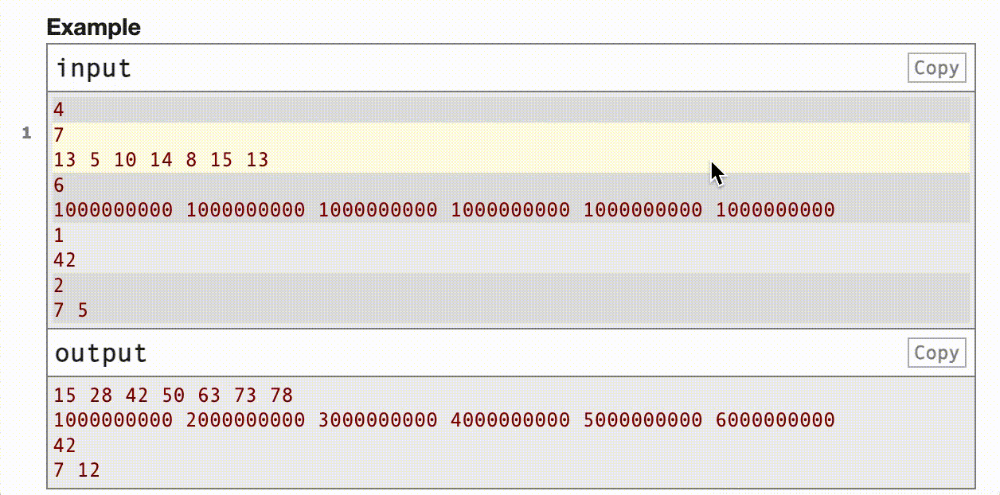

# Codeforces Copy Single Testcase

A Tampermonkey script to copy single testcase on [Codeforces](https://codeforces.com/).

## Installation

1. Install [Tampermonkey](https://www.tampermonkey.net/) in your browser.
2. Click [this link](https://raw.githubusercontent.com/hikariyo/cf-copy-single-testcase/refs/heads/master/cf-copy-single-testcase.user.js) to install the script.

## Usage

Just double-click one of the multiple testcases.



The copied content will be like:

```
1
7
13 5 10 14 8 15 13

1
1
42
```

As you can see, it automatically adds a `1` at the beginning of each testcase, so you can directly paste it as the input for your program.


## Contributing

Issues and PRs are welcome!

